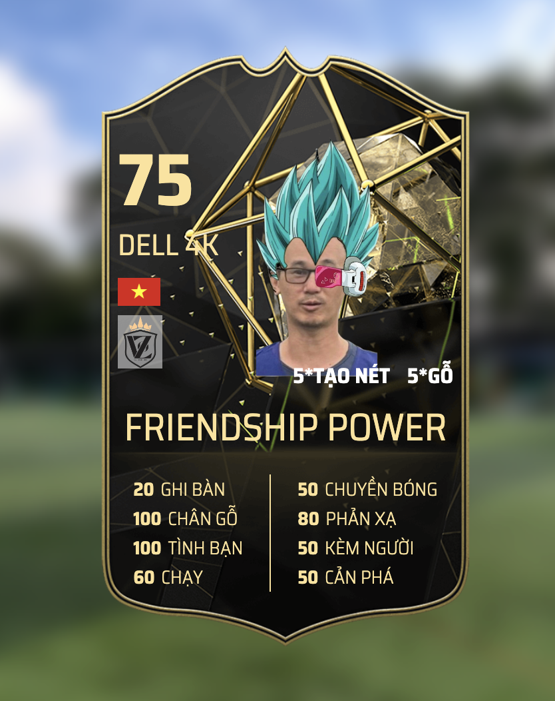

# FIFA CARD GENERATOR



```
themes list: magna gold titan flat hero evo black orange fighter purple blue champ yellow
```


## Vietnamese version
### Hướng dẫn sử dụng
- tạo thẻ cầu thủ fifa
- mở file index.html với chrome và xem hình ảnh
- mới mỗi thay đổi bạn có thể refresh lại trình duyệt để xem thông tin được cập nhật
###  Cách thay đổi hình cầu thủ
- b1: lên https://www.remove.bg/ upload hình để xoá background
- b2: tải hình về đổi tên thành player.png và dán đè vào thư mục "card/images" hoặc thay đổi đường dẫn trong file  `player.js` mục `avatar`
### Cách thay đổi background của thẻ
- trong thư mục images/card_bg có các phiên bản bg khác nhau với tên
- mở file `player.js` tìm dòng `theme` thay đổi giao diện bạn thích các giao diện là tên của file trong thư mục 
### Cách thay đổi các thuộc tính cơ bản của player
- vào file `player.js` tìm kiếm và thay đổi thông tin theo ý thích
### Cách tải file về lưu
- để chuột vào thẻ, nhấn chuột phải chọn `save Image as` trên trình duyệt

## English version
### Usage Instructions
- Create FIFA player cards
- Open the index.html file using Chrome to view the images
- After each change, you can refresh the browser to see the updated information

### Changing Player Image
- Step 1: Go to https://www.remove.bg/ to upload an image and remove the background
- Step 2: Download the processed image, rename it to player.png, and overwrite it in the "card/images" folder, or change the path in the "player.js" file under the "avatar" section
### Changing Card Background
- In the images/card_bg folder, there are different versions of backgrounds with names
- Open the "player.js" file, find the "theme" line, and change to the theme you prefer; themes correspond to the filenames in the folder
### Changing Player Attributes
- Open the "player.js" file, search for and modify information according to your preferences
### Downloading and Saving Files
- Hover over the card, right-click, and select "Save Image as" in the browser

## Chinese version
### 使用说明
- 创建FIFA球员卡
- 使用Chrome打开index.html文件，查看图像
- 每次更改后，您可以刷新浏览器以查看更新的信息
### 更改球员图片的方法
- 步骤1：访问https://www.remove.bg/，上传图片以删除背景
- 步骤2：将下载的图片重命名为player.png，并覆盖到“card/images”文件夹中，或在“player.js”文件的“avatar”部分更改路径
### 更改卡片背景的方法
- 在images/card_bg文件夹中，有不同名称的背景版本
- 打开“player.js”文件，找到“theme”行，更改您喜欢的主题，主题名称与文件夹中的文件名对应
### 更改球员基本属性的方法
- 打开“player.js”文件，根据您的喜好搜索并更改信息
### 下载并保存文件的方法
- 鼠标移到卡片上，右键单击，在浏览器中选择“另存为图像”

## Spanish version
### Instrucciones de Uso
- Crear tarjetas de jugadores de FIFA
- Abrir el archivo index.html en Chrome para ver las imágenes
- Después de cada cambio, puedes actualizar el navegador para ver la información actualizada
### Cambiar la Imagen del Jugador
- Paso 1: Ir a https://www.remove.bg/ para subir la imagen y eliminar el fondo
- Paso 2: Descargar la imagen procesada, renombrarla como player.png y sobrescribirla en la carpeta "card/images", o cambiar la ruta en el archivo "player.js" en la sección "avatar"
### Cambiar el Fondo de la Tarjeta
- En la carpeta images/card_bg, encontrarás distintas versiones de fondos con nombres
- Abrir el archivo "player.js", encontrar la línea "theme" y cambiar al tema de tu preferencia; los nombres de los temas corresponden a los nombres de los archivos en la carpeta
### Modificar Atributos del Jugador
- Abrir el archivo "player.js", buscar y modificar la información según tus preferencias
### Descargar y Guardar Archivos
- Coloca el cursor sobre la tarjeta, haz clic derecho y selecciona "Guardar imagen como" en el navegador

## Hindi version
### उपयोग निर्देश
- फ़ीफ़ा खिलाड़ी कार्ड बनाएं
- छवियों को देखने के लिए Chrome का उपयोग करके index.html फ़ाइल खोलें
- प्रत्येक परिवर्तन के बाद, आप अपडेट हुई जानकारी देखने के लिए ब्राउज़र को रिफ़्रेश कर सकते हैं
### खिलाड़ी की छवि कैसे बदलें
- चरण 1: https://www.remove.bg/ पर जाएं ताकि छवि अपलोड करें और पृष्ठभूमि हटा दें
- चरण 2: संसोधित छवि को डाउनलोड करें, उसे player.png के रूप में पुनःनामित करें, और "card/images" फ़ोल्डर में उपयोगकर्ता.png के रूप में ओवरराइट करें, या "player.js" फ़ाइल के "avatar" अनुभाग के तहत मार्ग में परिवर्तन करें
### कार्ड की पृष्ठभूमि कैसे बदलें
- images/card_bg फ़ोल्डर में, नाम के साथ विभिन्न संस्करणों की पृष्ठभूमि है
- "player.js" फ़ाइल खोलें, "थीम" लाइन खोजें, और आपकी पसंदीदा थीम में परिवर्तन करें; थीम फ़ोल्डर में फ़ाइलों के नामों के साथ मेल खाते हैं
### खिलाड़ी की गुणवत्ता कैसे बदलें
- "player.js" फ़ाइल खोलें, अपनी पसंद के अनुसार जानकारी को खोजें और संशोधित करें
### फ़ाइलें डाउनलोड और सहेजने कैसे
- कार्ड पर होवर करें, दाएँ क्लिक करें, और ब्राउज़र में "छवि को बचाओ" का चयन करें


## Arabic version
### إرشادات الاستخدام
- إنشاء بطاقات لاعبي فيفا
- افتح ملف index.html باستخدام Chrome لعرض الصور
- بعد كل تغيير، يمكنك تحديث المتصفح لرؤية المعلومات المحدثة
### كيفية تغيير صورة اللاعب
- الخطوة 1: انتقل إلى https://www.remove.bg/ لتحميل الصورة وإزالة الخلفية
- الخطوة 2: قم بتنزيل الصورة المعالجة، وأعد تسميتها إلى player.png، واستبدلها في مجلد "card/images"، أو قم بتغيير المسار في ملف "player.js" تحت القسم "avatar"
### كيفية تغيير خلفية البطاقة
- في مجلد images/card_bg، ستجد إصدارات مختلفة من الخلفيات بأسماء
- افتح ملف "player.js"، ابحث عن السطر "theme"، وقم بتغيير السمة التي تفضلها؛ السمات تتوافق مع أسماء الملفات في المجلد
### كيفية تغيير سمات اللاعب
- افتح ملف "player.js"، ابحث عن وقم بتعديل المعلومات حسب تفضيلاتك
### كيفية تنزيل وحفظ الملفات
- حوّل المؤشر فوق البطاقة، انقر بزر الماوس الأيمن، واختر "حفظ الصورة ك" في المتصفح
